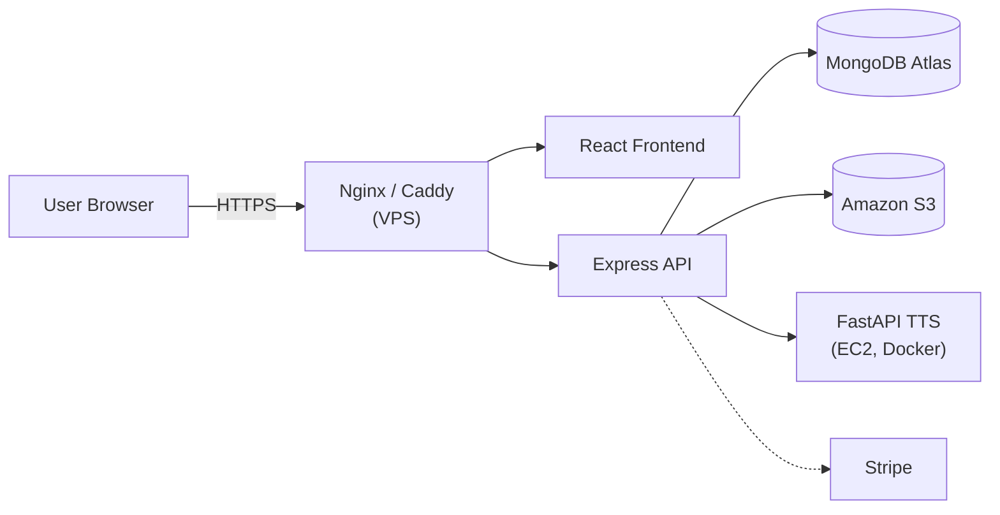

# Global Architecture

This diagram presents the **global architecture** of the system and how the main
components interact.

```mermaid
flowchart LR
  U[User Browser] -->|HTTPS| N["Nginx / Caddy<br>(VPS)"]

  N --> FE[React Frontend]
  N --> BE[Express API]

  BE --> DB[(MongoDB Atlas)]
  BE --> S3[(Amazon S3)]
  BE --> ML["FastAPI TTS<br>(EC2, Docker)"]

  BE -.-> ST[Stripe]
```

